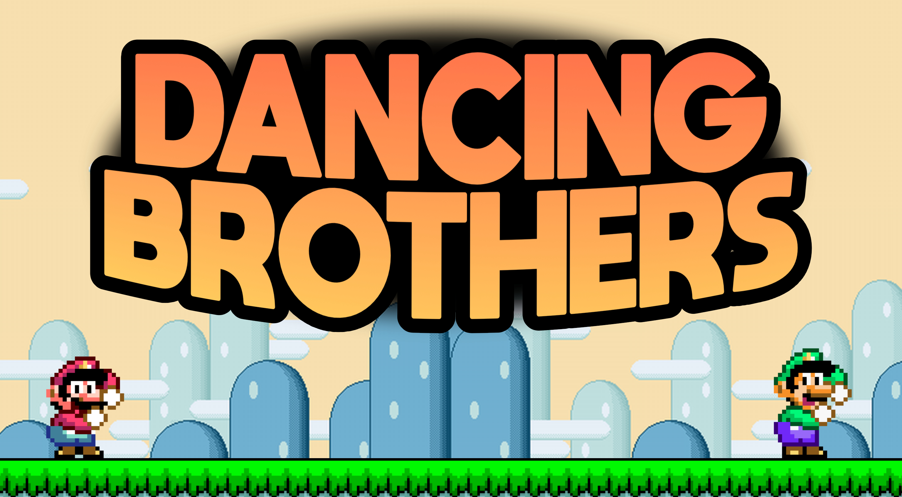

# Do the Mario!

This is a simple Mario 'platformer' built with Javascript and CSS. Based on a lesson by Maikel Putman.

# [Click here to play the game in your browser](https://heind.nl/projects/marioplatformer/index.html)

### Authors

* Hein Dijstelbloem
* Maikel Putman

### Description

This game allows you to control Mario as he runs and jumps across a side-scrolling landscape. Luigi will also appear after holding down the right arrow for a bit.

### Features

* Move Mario left and right using the arrow keys
* Run faster by holding `Shift`
* Jump with the up arrow key
* Play background music
* Let out Mario's frustration by pressing SPACE!
* High end Luigi spawning mechanics
* Move Luigi left and right with the arrow keys (when spawned). That way, it looks like he's remaining in place.

### Controls

* Left Arrow: Move Mario left
* Right Arrow: Move Mario right
* Up Arrow: Jump
* Shift: Run faster
* Space: Play jump sound effect.

### Requirements

* A modern web browser

### Setup

1. Clone this repo.
2. Start a live server and you are able to play.

### Running the Game

1. Open the HTML file containing the game code in your web browser.

### Notes

* This is a basic implementation and lacks features like collision detection and enemies.
* Jumping is a bit finnicky right now.

### Special thanks
* [DeviantArt user Josuecr4ft for the dancing Mario and Luigi](https://www.deviantart.com/josuecr4ft/art/SMW-Mario-and-Luigi-dancing-meme-920443430)
* [DeviantArt user CursedMario for the sprite of Luigi dancing looking more like SMW](https://www.deviantart.com/cursedmario/art/SMAS-SMW-Luigi-Dancing-921139073)
* Maikel Putman for explaning the tutorial.
* SiivaGunner contributors for SMW - Athletic (PAL Version)
* Classic YTP's for 'mama f*****'

